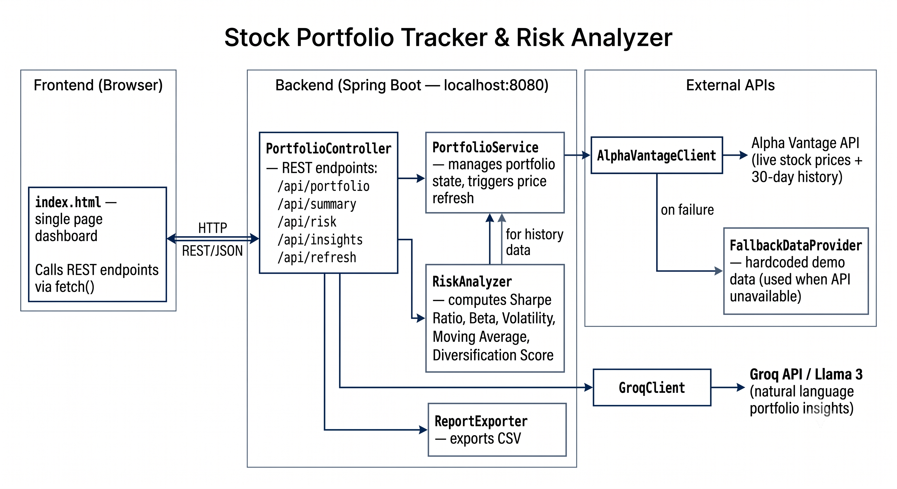

# Stock Portfolio Tracker & Risk Analyzer



A full-stack financial analytics application built with **Java** and **Spring Boot**. Tracks a stock portfolio with live market data, computes industry-standard risk metrics, and generates AI-powered natural language insights via Groq (Llama 3).

---

## Features

- **Live prices** fetched from Alpha Vantage API with rate-limit-aware sequential scheduling
- **Risk metrics** — Sharpe Ratio, annualized Volatility, true Beta (SPY covariance), 30-day Moving Average, Diversification Score
- **Interactive dashboard** — single-page frontend with holdings table, sparklines, sector breakdown, and KPI cards
- **AI Insights** — Groq (Llama 3) generates a natural language interpretation of the portfolio's risk and performance
- **CSV export** of full portfolio + risk report
- **REST API** — Spring Boot backend exposes clean JSON endpoints

---

## Tech Stack

| Layer | Technology |
|---|---|
| Backend | Java 17, Spring Boot 3, REST API |
| Frontend | HTML, CSS, JavaScript (vanilla) |
| Market Data | Alpha Vantage API |
| AI Analysis | Groq API (Llama 3.3 70B) |
| Build | Maven |
| Deployment | Railway |

---

## Architecture

```
Browser (index.html)
      ↕ fetch() / JSON
Spring Boot REST API (localhost:8080)
  ├── PortfolioController   → /api/portfolio, /api/summary, /api/risk, /api/insights, /api/refresh
  ├── PortfolioService      → portfolio state, price refresh, P&L
  ├── RiskAnalyzer          → Sharpe Ratio, Beta, Volatility, Moving Average
  ├── AlphaVantageClient    → live prices + 30-day history (with fallback)
  └── GroqClient            → Llama 3 natural language insights
```

---

## Getting Started

**Prerequisites:** Java 17+, Maven

**1. Clone the repo**
```bash
git clone https://github.com/aishwaryadeshmukhh/stockportfoliomgmt.git
cd stockportfoliomgmt
```

**2. Add API keys**

Create `src/main/resources/application.properties`:
```properties
server.port=8080
spring.application.name=stock-portfolio-tracker
alphavantage.apikey=YOUR_ALPHA_VANTAGE_KEY
groq.apikey=YOUR_GROQ_KEY
```

- Alpha Vantage free key: [alphavantage.co](https://www.alphavantage.co/support/#api-key)
- Groq free key: [console.groq.com](https://console.groq.com)

**3. Build and run**
```bash
mvn package -DskipTests
java -jar target/stock-portfolio-tracker-1.0-SNAPSHOT.jar
```

**4. Open the dashboard**

Navigate to `http://localhost:8080` after the server prints `Ready.`

> Note: startup takes ~65 seconds as prices are fetched sequentially to respect the free API rate limit (25 req/day, 5 req/min).

---

## API Endpoints

| Method | Endpoint | Description |
|---|---|---|
| GET | `/api/portfolio` | All holdings with P&L |
| GET | `/api/summary` | Portfolio-level totals |
| GET | `/api/risk` | Risk metrics per stock + portfolio |
| GET | `/api/insights` | AI-generated analysis (Groq) |
| POST | `/api/refresh` | Refresh live prices |
| POST | `/api/portfolio/add` | Add a stock |
| DELETE | `/api/portfolio/{symbol}` | Remove a stock |

---

## Demo Portfolio

| Symbol | Sector | Buy Price | Qty |
|---|---|---|---|
| AAPL | Technology | $150.00 | 10 |
| GOOGL | Technology | $140.00 | 5 |
| JPM | Finance | $130.00 | 8 |
| TSLA | Automotive | $200.00 | 6 |
| MSFT | Technology | $300.00 | 4 |

---

## Environment Variables (for deployment)

| Variable | Description |
|---|---|
| `ALPHAVANTAGE_APIKEY` | Alpha Vantage API key |
| `GROQ_APIKEY` | Groq API key |
| `PORT` | Server port (set automatically by Railway) |
